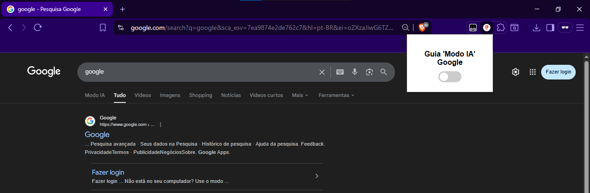

### 🛡️ Extensão: Esconde Guia do Modo IA no Google

Esta extensão do Chrome permite **ocultar a guia do Modo IA** na página do Google.  
Ela inclui um **botão on/off** para ativar ou desativar a função rapidamente.

---

### 🚀 Funcionalidades

- Oculta automaticamente a guia do Modo IA na página do Google.  
- Botão **on/off** para ativar ou desativar a função sem precisar remover a extensão.  
- Mantém a página do Google limpa e organizada.  

---

### 📦 Estrutura da Extensão

```

extensao-esconde-guia-do-modo-ia-google/
├── manifest.json       # Configuração da extensão
├── content.js          # Script que oculta a guia do Modo IA
├── popup.html          # Interface do botão on/off
├── popup.js            # Lógica do botão on/off
├── style.css           # Estilo do popup
└── icon.png            # Ícone da extensão

````

---

### ⚙️ Como instalar no Chrome

### 1️⃣ Clonar o repositório

```bash
git clone https://github.com/luisSun/extensao-esconde-guia-do-modo-ia-google.git
cd extensao-esconde-guia-do-modo-ia-google
````

### 2️⃣ Carregar no Chrome

1. Abra o Chrome e vá para `chrome://extensions/`.
2. Ative o **Modo desenvolvedor** (canto superior direito).
3. Clique em **Carregar sem compactação** (`Load unpacked`) e selecione a pasta da extensão.
4. O ícone aparecerá na barra do Chrome e você poderá usar o botão on/off.

---

## 👀 Antes e Depois

### Antes



### Depois


---

## ✍️ Autor

**Luis Fernando Afonso**
💼 Projeto pessoal para estudo e utilidade no Google Chrome
📧 Contato: [luis.sun@gmail.com](mailto:luis.sun@gmail.com)

---

## 🧾 Licença

Esta extensão está licenciada sob a **GNU GENERAL PUBLIC LICENSE v3.0**.


[Saiba mais sobre a GNU GPLv3](https://www.gnu.org/licenses/gpl-3.0.html)
